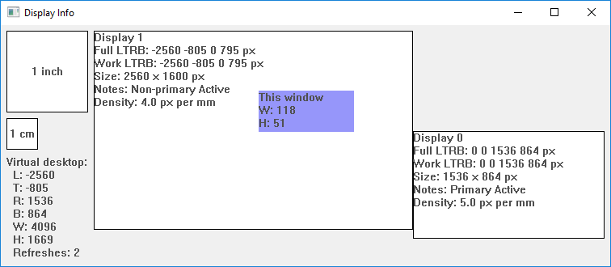

# EDID display lib

A small library to detect all monitors including physical sizes, Windows only (for now).

Windows UI:



Console:

```
Found 1 display device

Virtual desktop size:
  LTRB: 0 0 2560 1600
  W x H: 2560 x 1600

Display device:
  seq: 0
  name: [\\.\DISPLAY2]
  device name: [MONITOR\HWP2690\{4d36e96e-e325-11ce-bfc1-08002be10318}\0006]
  device str: [Generic PnP Monitor]

  status: Primary
  is-active: true

  full rect (LTRB): 0 0 2560 1600
  work rect (LTRB): 0 0 2560 1600
  physical width x height: 641mm  x  400mm

  density 4.0 px per mm
  density 0.250 mm per px
  1.0cm on this screen is 39.9 px
  1.0in on this screen is 101.4 px
```

Origin:

- Based on https://github.com/aellerton/EDID-Parser-Windows
- which was forked from https://github.com/athairus/EDID-Parser-Windows
- which was based on http://ofekshilon.com/2014/06/19/reading-specific-monitor-dimensions/

TODO

- Understand per monitor DPI awareness
- https://docs.microsoft.com/en-us/windows/desktop/hidpi/high-dpi-desktop-application-development-on-windows
- https://docs.microsoft.com/en-gb/windows/desktop/api/shellscalingapi/nf-shellscalingapi-setprocessdpiawareness

